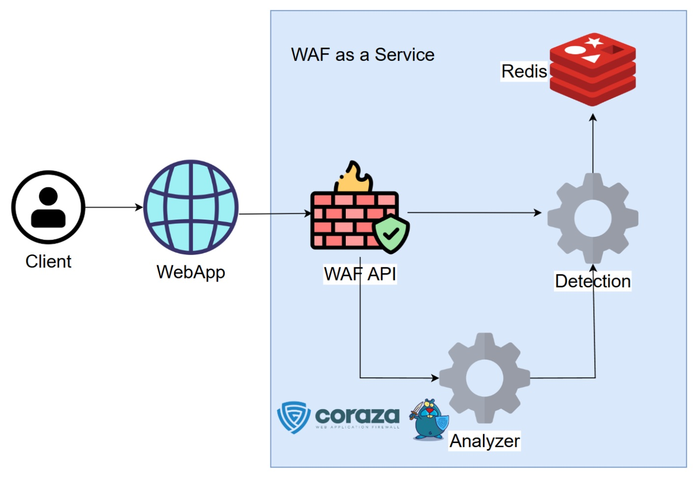

# WAF Service

## Description
Web application firewall as a service (WAFaaS). Provides an API to analyze HTTP requests for OWASP Top Ten
vulnerabilities using OWASP coreruleset. 

WAF service API is called from web application middleware: incoming requests
are analyzed in background. When an attack is detected, client ip is saved. Further requests from this ip will always be
analyzed inline, so when the attack is found, request will be blocked.




Example [demo app](http://rwfshr.ru:8080/) featuring WAFaaS is available.

## Features
  - **Full control**: Control and configure blocking behaviour on application level.
  - **Avoiding latency**: minimal latency for regular users. Only suspicious requests are analyzed inline.  


## Getting started
### Installing
Adjust configuration files located in 
 - `analyzer/config`
 - `waf/config`
 - `detection/config`

if needed. Then run:
```
make run
```
to run the service.
### Updating
To update the service run:
```
make update
```
### Running the tests
Integration tests are available.

Adjust configuration files located in `tests/config` if needed. Then run
```
make test
```
### Running the linter
Golangci-lint is available.

To run linter run:
```
make lint
```
### Enabling WAF
#### Golang http package:
```go
package main

import (
	"context"
	wafpkg "github.com/Goose47/waf"
	"net/http"
)

func main() {
	// Configure WAF instance.
	waf, err := wafpkg.New(wafpkg.WithHostPort("rwfshr.ru", 8000))
	if err != nil {
		panic(err)
	}

	http.HandleFunc("/protected", func(w http.ResponseWriter, r *http.Request) {
        // Analyze request.
        res, err := waf.Analyze(context.Background(), r)
        if err != nil {
            // WAF is unavailable...
            w.WriteHeader(http.StatusInternalServerError)
            return
        }
        if res {
            // Process attacks...
            w.WriteHeader(http.StatusForbidden)
            return
        }

        w.WriteHeader(http.StatusOK)
        _, _ = w.Write([]byte("OK"))
	})

	_ = http.ListenAndServe(":8000", nil)
}
```

## Deployment
When pushed on main, linters and integration tests are run automatically. If no error occurs, application is updated automatically


## Links
  - Sample library to use with go http package: [github.com/Goose47/waf](https://github.com/Goose47/waf)
  - PB repo: [github.com/Goose47/wafpb](https://github.com/Goose47/wafpb)
